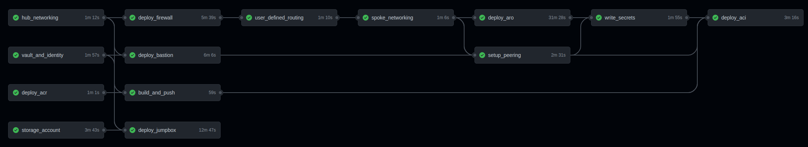

Deploying Azure Red Hat OpenShift (ARO) is a fairly straightforward process. By following the [official documentation](https://docs.microsoft.com/en-au/azure/openshift/intro-openshift), creating the required Azure infrastructure and running the deployment command, a highly available OpenShift cluster will become available and ready to run containerised workloads in approximately 30-40 minutes.

Integrating ARO into existing Azure enterprise architectures can take a little more time, as networking, routing and traffic rules need to be created. Inspired by the [ARO reference architecture](https://github.com/UmarMohamedUsman/aro-reference-architecture), this repo contains bicep modules which will deploy ARO and other common resources found in enterprise Azure environments using a consistent, repeatable deployment method and will take approximately 45 minutes to complete. 

# Architecture

This deployment is a hub/spoke architecture. The Hub resource group will deploy and configure essential Azure resources required for the depoyment of a private ARO cluster. The ARO cluster and its virtual network will be located in the spoke resource group. This architecture should allow further ARO deployments as part of another spoke resource group (not deployed here). As part of the ARO deployment another resource group will be created which will contain the non-configurable resources of the ARO cluster such as control plane and worker node virtual machines, load balancers, network interfaces etc.

## Hub Resource Group

In the Hub resource group the following resources are deployed;

### Hub virtual Network

The hub vnet contains all the subnets for the hub services. This includes firwall, bastion service, and container registries. This hub network is peered with the spoke's virtual network.

### Keyvault and Managed Identity

A keyvault is created which will store the secrets produced by the ARO cluster. The managed identity is created to be used by the Jumpbox and Azure container instance to access the secrets in the keyvault. The container instance will configure the ARO cluster using yaml and OC commnads, whereas the jumpbox will use the managed identity to populate a script which will make logging in from a resource on the network a lot faster.

### Azure container Registry

A container based on the Red Hat universal base image (UBI) is built which can be used to configure the private ARO cluster. The Azure container registry will store the built image which is pulled when the container instance is deployed in the pipeline.

### Storage Account

The storage account is deployed with a blob that contains a custom script extension (CSE). This custom script extension is used to configure the Windows jump box with tooling that makes it easier to connect to and configure the private Azure Container registry.

### Firewall

The firewall will be used to configure inbound and outbound traffic from the private ARO cluster. Firewall rules will need to be configured to allow pulling containers from external image repositories. Given that new ARO clusters (OpenShift 4.6+) now use a feature called "egress lockdown" the cluster can still scale as expected as all OpenShift core containers and Red Hat Core OS (RHCOS) images are collected from the service's resources via the deployed private link.

### Bastion Service and Jumpbox

A jumpbox is deployed to provide access to the private network. This is protected by the Azure Bastion service whih also allows for a HTML5 remote desktop session.

### Container Build and Instance

As part of the deployment process, a pipeline job will build a contianer image which contains tools to help configure the ARO private cluster. This container will be pushed to the Azure container registry and then pulled by the Azure container instance. The Azure container instance will deploy to a subnet within the hub and will have connectivity to the ARO private cluster via peering.

### Secrets in Keyvault

The Azure keyvault will store the kubeadmin password and api endpoint of the private ARO cluster. This keyvault will then be used by a managed identity attached to the jumpbox and container instances to access and configure the cluster.

## Spoke Resource Group

In the Spoke resource group the following resources are deployed;

### Spoke Network with Peering

This virtual network will contain the required ARO control plane and worker subnets. This vnet is peered to the vnet in the hub.

### User Defined Routing (UDR)

A route is created which will direct all traffic to and from the ARO cluster to the Azure firewall. This UDR is applied to both the ARO control plane and ARO worker subnets.

### ARO Cluster

Finally the ARO cluster is created which will allow you to deploy your containerised workloads in a secure manner.

# Deployment Method - Github Actions

1. This repo has been designed to run bicep modules for the above resources in a github actions pipeline using public runners. It is advised to copy this repo to a prviate github repo so that you can deploy from a private github repository.



The service principal used for the github actions deployment will be scoped to the resource group level. This means that there will initally be a additional steps to create a service principal, resource groups and assign the appropriate permissions. These steps will only have to be run once for as long as the resource groups and service principal remain within the Azure environment. The github actions workflow will use public runners unless otherwise configured.

> :warning: Please be careful about how you store secrets. It is advised to use a private repo to ensure that there is a less chance of private data exposure.

## Github actions prerequisites

### Create resource groups

> :warning: Try not to delete the resource groups once created or you will need to run the permissions commands again.

As a user run the following command to create resource groups that will be used for the github actions deployment.

```
$ export SUBSCRIPTION=$(az account show --query id -o tsv)
$ export LOCATION=<insert location here>
$ export HUB_RG="<insert hub resource group name here>"
$ export SPOKE_RG="<insert spoke resource group name here>"

$ az group create -n $HUB_RG -l $LOCATION
$ az group create -n $SPOKE_RG -l $LOCATION

```

Alternatively I have created a shell script called `ent_rg_create.sh` which will run all of these commands for you. You will need to change the variables at the top of the file to suit your environment.

### Create a service principal

Create a service principal that will run the github actions bicep modules. This SP will also be granted "User access admin" permission on the spoke resource group, this is to ensure that the ARO deployment can assign the resource provider "Red Hat OpenShift RP" permissions to the spoke resource group.

```
$ export SP_NAME="<insert name for the service principal here>"

$ az ad sp create-for-rbac -n $SP_NAME --role contributor --sdk-auth --scopes "/subscriptions/$SUBSCRIPTION/resourceGroups/$SPOKE_RG" > sp.txt

$ export AAD_CLIENT_ID=$(az ad sp list --all --query "[?displayName == '$SP_NAME'].appId" -o tsv)

```

### Scope the service principal's permissions to the hub and spoke resource groups

```
$ export SCOPE_HUB=$(az group create -n $HUB_RG -l $LOCATION --query id -o tsv)
$ export SCOPE_SPOKE=$(az group create -n $SPOKE_RG -l $LOCATION --query id -o tsv)


$ az role assignment create --assignee $AAD_CLIENT_ID --role contributor --scope $SCOPE_HUB
$ az role assignment create --assignee $AAD_CLIENT_ID --role contributor --scope $SCOPE_SPOKE
$ az role assignment create --assignee $AAD_CLIENT_ID --role "User Access Administrator" --scope $SCOPE_SPOKE

```

### Modify parameter

1. Modify the parameters found in `./action_params/*.json` to suit your environment.

1. Modify the parameters found in `./github/workflows/action_deploy_aro_enterprise.yml` to suit your environment.
    * LOCATION (location for resources)
    * ACR_USERNAME (the default user for Azure container registry)
    * CONTAINER_BUILD NAME (the desired name of the configuration container stored in the Azure container registry)

### Create github encrypted secrets to be used by github actions

The following secrets will need to be created in the github repository as "Action Secrets". Go to your repo > select settings > select secrets > select Actions > select "New repository secret".

Alternatively, I have created a shell script called `gh_secrets_create.sh` which uses the github command line to create the secrets for you. Before running this file you would have needed to do the following;

* Install and logged in to the "gh" command line,
* Logged into gh cli and ensured that you are interacting with the correct github repository,
* Changed the variables at the top of `gh_secrets_create.sh` to match your environment.

### Manually populate github secrets;

| Secret Name | Command to run to get correct value for secret | 
| --- | --- | 
| AZURE_SUBSCRIPTION | ` az account show --query id -o tsv ` | 
| AZURE_CREDENTIALS | copy the contents of sp.txt here. Json format will work | 
| AAD_CLIENT_ID | `az ad sp list --all --query "[?displayName == '$SP_NAME'].appId" -o tsv` |
| AAD_CLIENT_SECRET | `cat sp.txt \| jq -r .clientSecret ` | 
| AAD_OBJECT_ID | `az ad sp show --id $AAD_CLIENT_ID --query id -o tsv`  |
| ARO_RP_OB_ID | `az ad sp list --all --query "[?appDisplayName=='Azure Red Hat OpenShift RP'].id" -o tsv` |
| JUMPBOX_ADMIN_USER | \<insert the name of the windows user for the jumpbox\> | 
| JUMPBOX_ADMIN_PWD | \<insert the password for the jumpbox\> | 
| SPOKE_RG | \<insert the spoke resource group name\> | 
| HUB_RG | \<insert the hub resource group name\> |
| PULL_SECRET | Format the Red Hat Pull Secret with the following command `cat pull-secret.json \| sed 's/"/\\"/g'` then place the output into the secret

> :Note: The pull secret should have the following syntax prior to adding it to the github secret `{\"auths\":{\"cloud.openshift.com\":{\"auth\":\"XXXXXXXXXX\" ...`


## Github actions Deployment

To run the github actions to deploy the environment select the following;


## Github actions Cleanup

To run the github actions to deploy the environment select the following;


### Cleanup Azure resource groups

To complete a full cleanup of Azure resources I have created a shell script called `ent_rg_delete.sh` which will run resource group delete commands for you. You will need to change the variables at the top of the file to suit your environment.

An azure keyvault stays in a deleted state for approximately 90 days after deletion. This script will also purge the keyvault to ensure that there are no failures on the next ARO deployment.

# OpenShift configuration

Configuration of the OpenShift cluster for day2 (oauth providers, storage classes, or OpenShift operators) is performed using the `openshift_operators/openshift_config.sh` script. This script uses a managed identity to pull the ARO kubeadmin password and api endpoint from Azure keyvault and then runs commands against the ARO cluster with kubernetes cluster admin privileges.

Whilst this script works for initial configuration of a private cluster, in a production environment it is recommended to use a kubernetes configuration tool such as Red Hat Advanced Cluster Management (RHACM).

# Jumpbox configuration

The Windows jumpbox is configured using the custom script extension found in `config_jumpbox/openshift.ps1`. It deploys tools which will be useful for interacting with the OpenShift cluster. None of the tools in this script are mandatory, so please feel free to change in order to match your environment.

# Upcoming Features
* Configure Azure logging integration
* Learn more about Bicep, Azure and Github actions and continuously improve the code
* VPN or A cloud shell deployed to a private network
* Web Application Firewall (WAF) or Azure front door

# **Pull Requests are welcome!**